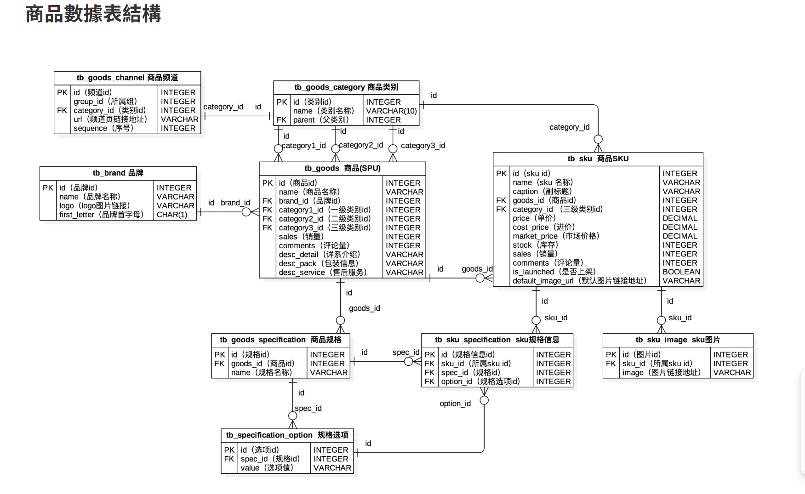

## 🔍 Elasticsearch 整合與索引管理

本專案使用 `Elasticsearch` 實現商品搜尋功能，搭配 `django-elasticsearch-dsl` 框架整合 Django 模型與 Elasticsearch 索引。

---

### 📦 依賴套件安裝

請在虛擬環境中安裝以下套件：

```bash
pip install elasticsearch==7.17.0
pip install elasticsearch-dsl==7.4.0
pip install django-elasticsearch-dsl==7.3
pip install django-elasticsearch-dsl-drf==0.21
```

---

### ⚙️ 索引操作指令

```python
# ❗刪除現有索引（如果有）並重新建立（適用於結構修改）
python manage.py search_index --rebuild

# 將資料庫中的現有資料填入索引（populate）
python manage.py search_index --populate

# 更新索引中有變動的資料（新增/修改），不刪資料
python manage.py search_index --update

```

### 🐳 Elasticsearch 伺服器端 Docker .tar 檔案下載
📎 Elasticsearch v7.17.20（含 IK 分詞器）Docker 映像檔
`https://drive.google.com/file/d/1g5kv0ROARFwfrfi62Y_hRV9DDdfHdoSF/view?usp=sharing`

